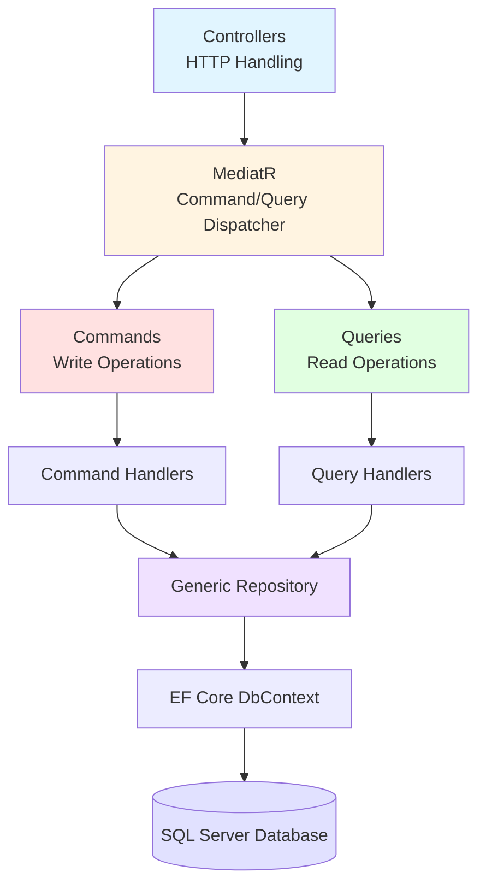

# 🎓 Employee Admin Portal - Educational Management System

A modern ASP.NET Core Web API built with **CQRS**, **MediatR**, **Repository Pattern**, and **Serilog** for managing educational entities including Employees, Teachers, Students, and Subjects.

[](https://dotnet.microsoft.com/)
[](https://docs.microsoft.com/en-us/dotnet/csharp/)
[](https://opensource.org/licenses/MIT)

---

## 📋 Table of Contents

- [Features](#-features)
- [Architecture](#-architecture)
- [Tech Stack](#-tech-stack)
- [Project Structure](#-project-structure)
- [Getting Started](#-getting-started)
- [Database Schema](#-database-schema)
- [API Documentation](#-api-documentation)
- [Configuration](#-configuration)
- [Logging](#-logging)
- [Contributing](#-contributing)

---

## ✨ Features

### 🎯 Core Functionality
- **Employee Management** - CRUD operations for employee records
- **Teacher Management** - Manage teacher profiles with employee linkage
- **Student Management** - Handle student information and enrollments
- **Subject Management** - Course and subject administration

### 🏗️ Architectural Patterns
- ✅ **CQRS Pattern** - Separation of read and write operations
- ✅ **Mediator Pattern** - Decoupled request/response handling with MediatR
- ✅ **Repository Pattern** - Generic repository for data access abstraction
- ✅ **Dependency Injection** - Built-in ASP.NET Core DI container

### 🔧 Technical Features
- 📝 Comprehensive logging with **Serilog** (Console, File, and Database)
- 📖 API Documentation with **Swagger/OpenAPI** and **Scalar**
- 🗄️ Entity Framework Core with SQL Server
- 🔄 Async/Await patterns throughout
- 🎨 Clean Architecture principles

---

## 🏛️ Architecture

This project implements **CQRS (Command Query Responsibility Segregation)** pattern:



**Flow:**
1. **Controllers** receive HTTP requests
2. **MediatR** dispatches commands/queries to appropriate handlers
3. **Handlers** process business logic
4. **Repository** abstracts data access
5. **EF Core** manages database operations

---

## 🛠️ Tech Stack

### Core Framework
- **.NET 8.0** - Latest LTS version
- **C# 12.0** - Modern C# features
- **ASP.NET Core Web API** - RESTful API framework

### 📦 Packages & Libraries

| Package | Version | Purpose |
|---------|---------|---------|
| MediatR | 13.1.0 | CQRS implementation |
| Entity Framework Core | 9.0.10 | ORM for database access |
| Serilog.AspNetCore | 9.0.0 | Structured logging |
| Swashbuckle (Swagger) | 6.6.2 | API documentation |
| Scalar.AspNetCore | 2.10.3 | Modern API docs UI |
| AutoMapper | 12.0.1 | Object mapping |
| Dapper | 2.1.66 | Micro ORM |
| JWT Bearer | 8.0.21 | Authentication (future) |

---

## 📁 Project Structure

```
EmployeeAdmnPortal/
│
├── CQRS/
│   ├── Commands/    # Write operations
│   │   ├── post-emp-command.cs
│   │ ├── put-emp-command.cs
│   │   ├── delete-emp-command.cs
│   │   ├── post-student-command.cs
│   │   ├── post-teacher-command.cs
│   │   └── post-subject-command.cs
│   │
│   ├── Query/    # Read operations
│   │   ├── get-emp-query.cs
│   │   ├── get-student-query.cs
││   ├── get-teacher-query.cs
│   │   └── get-subject-query.cs
│   │
│   ├── Handler/   # Request handlers
│   │   ├── PostEmpAsync.cs
│   │   ├── GetEmpAsync.cs
│   │   ├── PutEmpAsync.cs
│   │   ├── DeleteEmpAsync.cs
│   │   └── ... (Student, Teacher, Subject handlers)
│   │
│   └── Infrastructure/       # Repository pattern
│├── Repo.cs          # Generic repository interface
│   └── Implementation.cs        # Repository implementation
│
├── Controllers/          # API endpoints
│   ├── EmployeesController.cs
│   ├── StudentsController.cs
│   ├── TeachersController.cs
│   └── SubjectsController.cs
│
├── Models/
│   ├── Entities/   # Domain models
│   │   ├── Employee.cs
│ │   ├── Student.cs
│   │   ├── Teacher.cs
│   │   └── Subject.cs
│   │
│   └── Dtos/                # Data transfer objects
│       └── Employeedto.cs
│
├── Data/
│   └── ApplicationDbContext.cs
│
├── Services/            # Business services
│   ├── ILoggerServices.cs
│   └── LoggerServices.cs
│
├── Mappings/          # AutoMapper profiles
│   └── MappingProfile.cs
│
├── Migrations/    # EF Core migrations
│
├── Program.cs   # Application entry point
└── appsettings.json  # Configuration
```

---

## 🚀 Getting Started

### Prerequisites

- **.NET 8.0 SDK** or later - [Download](https://dotnet.microsoft.com/download/dotnet/8.0)
- **SQL Server** (LocalDB, Express, or Full) - [Download](https://www.microsoft.com/sql-server/sql-server-downloads)
- **Visual Studio 2022** or **VS Code** (optional)
- **SQL Server Management Studio** (optional)

### Installation

#### 1️⃣ Clone the repository
```bash
git clone https://github.com/glitchedbit/AdminPortal-Practice-.git
cd EmployeeAdmnPortal
```

#### 2️⃣ Update Connection Strings

Edit `appsettings.json` and update the SQL Server connection strings:

```json
{
  "ConnectionStrings": {
    "DefaultConnection": "Server=YOUR_SERVER;Database=worksdb;Trusted_Connection=True;TrustServerCertificate=true",
    "DefaultlogConnection": "Server=YOUR_SERVER;Database=logsdb;Trusted_Connection=True;TrustServerCertificate=true"
  }
}
```

#### 3️⃣ Restore NuGet Packages
```bash
dotnet restore
```

#### 4️⃣ Apply Database Migrations
```bash
dotnet ef database update
```

#### 5️⃣ Run the Application
```bash
dotnet run
```

#### 6️⃣ Access the API

- **Swagger UI:** `https://localhost:5001/swagger`
- **Scalar Docs:** `https://localhost:5001/scalar`
- **API Base:** `https://localhost:5001/api`

---

## 🗄️ Database Schema

### Entity Relationships

```
Employee (1:1) ──────> Teacher
│
         │ (1:N)
    ▼
           Student
   │
           │ (N:M)
 ▼
    Subject
```

### 📊 Tables

#### **Employee**

| Column | Type | Description |
|--------|------|-------------|
| TableId (PK) | `int` | Primary key |
| Name | `string` | Employee name |
| Email | `string` | Contact email |
| Qualification | `string` | Educational background |
| Address | `string` | Physical address |

#### **Teacher**

| Column | Type | Description |
|--------|------|-------------|
| TeacherId (PK) | `int` | Primary key |
| Name | `string` | Teacher name |
| Qualification | `string` | Educational credentials |
| Class | `string` | Assigned class |
| Active | `bool` | Active status |
| TableId (FK) | `int` | Foreign key to Employee |

#### **Student**

| Column | Type | Description |
|--------|------|-------------|
| RollId (PK) | `int` | Primary key |
| Name | `string` | Student name |
| Class | `string` | Current class |
| Age | `int` | Student age |
| Active | `bool` | Enrollment status |
| TeacherId (FK) | `int` | Foreign key to Teacher |

#### **Subject**

| Column | Type | Description |
|--------|------|-------------|
| SubjectId (PK) | `int` | Primary key |
| CourseName | `string` | Subject name |

---

## 📚 API Documentation

### Base URL
```
https://localhost:5001/api
```

### 🎓 Students Endpoints

#### ➤ Get All Students
```http
GET /api/students
```

#### ➤ Add Student
```http
POST /api/students/add
Content-Type: application/json

{
  "name": "John Doe",
  "class": "10th Grade",
  "age": 15,
"active": true,
  "teacherId": 1
}
```

#### ➤ Update Student
```http
PUT /api/students/update
Content-Type: application/json

{
  "rollId": 1,
  "name": "John Doe Updated",
  "class": "11th Grade",
  "age": 16,
  "active": true,
  "teacherId": 1
}
```

#### ➤ Delete Student
```http
DELETE /api/students/delete/{id}
```

### 🔗 Similar endpoints exist for:
- `/api/teachers` 👨‍🏫
- `/api/subjects` 📖
- `/api/employees` 👔

> **Note:** For complete API documentation, visit the Swagger UI or Scalar interface when running the application.

---

## ⚙️ Configuration

### Environment Variables

The application uses `appsettings.json` for configuration:

```json
{
  "ConnectionStrings": {
    "DefaultConnection": "Database connection string",
    "DefaultlogConnection": "Logging database connection string"
  },
  "Logging": {
    "LogLevel": {
      "Default": "Information",
      "Microsoft.AspNetCore": "Warning"
    }
  },
  "AllowedHosts": "*"
}
```

### Serilog Configuration

Logs are written to:
- **Console** → Real-time output
- **File** → Daily rolling files in `/Logs` directory
- **Database** → Stored in SQL Server table `Logs`

---

## 📊 Logging

### 📈 Log Levels
- **Information** → General application flow
- **Warning** → Abnormal or unexpected events
- **Error** → Errors and exceptions

### 📍 Log Locations
1. **Console Output** - Development debugging
2. **File System** - `Logs/log-YYYYMMDD.txt` (rolling daily)
3. **SQL Server** - `logsdb.Logs` table (auto-created)

### Custom Logging Service

```csharp
public interface ILoggerServices
{
    void LogInfo(string message);
    void LogWarning(string message);
    void LogError(Exception ex, string message);
}
```

---

## 🧪 Testing

### Run the Application
```bash
dotnet run
```

### Build the Project
```bash
dotnet build
```

### Run Migrations
```bash
# Create migration
dotnet ef migrations add MigrationName

# Update database
dotnet ef database update

# Remove last migration
dotnet ef migrations remove
```

---

## 🔮 Future Enhancements

- [ ] JWT Authentication & Authorization
- [ ] Role-based access control (RBAC)
- [ ] AutoMapper integration (currently commented out)
- [ ] Unit & Integration tests
- [ ] Docker containerization
- [ ] CI/CD pipeline
- [ ] Health checks endpoint
- [ ] API versioning
- [ ] Rate limiting
- [ ] CORS configuration
- [ ] Response caching

---

## 🤝 Contributing

Contributions are welcome! Please follow these steps:

1. **Fork** the repository
2. **Create** a feature branch (`git checkout -b feature/AmazingFeature`)
3. **Commit** your changes (`git commit -m 'Add some AmazingFeature'`)
4. **Push** to the branch (`git push origin feature/AmazingFeature`)
5. **Open** a Pull Request

---

## 📝 License

This project is licensed under the **MIT License** - see the [LICENSE](LICENSE) file for details.

---

## 👨‍💻 Author

**glitchedbit**

- GitHub: [@glitchedbit](https://github.com/glitchedbit)
- Repository: [AdminPortal-Practice-](https://github.com/glitchedbit/AdminPortal-Practice-)

---

## 🙏 Acknowledgments

- ASP.NET Core Documentation
- MediatR by Jimmy Bogard
- Serilog Community
- Entity Framework Core Team
- Scalar API Documentation

---

## 📞 Support

If you encounter any issues or have questions:

1. Check the [Issues](https://github.com/glitchedbit/AdminPortal-Practice-/issues) page
2. Create a new issue with detailed information
3. Star ⭐ the repository if you find it helpful!

---

<div align="center">

### Made with ❤️ using .NET 8.0

</div>
